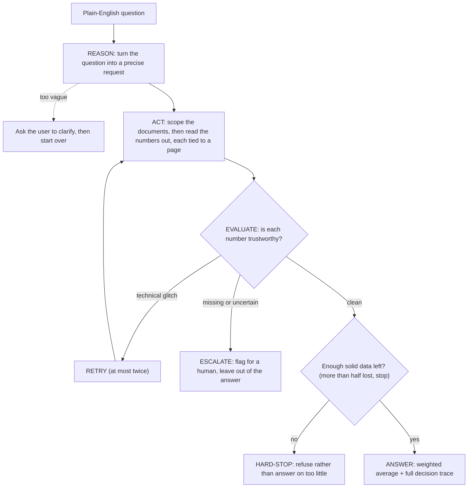

# AuditableRAG
Firms that hold or advise on baskets of funds constantly need precise, aggregate figures. That data sits scattered across thousands of unstructured, messy PDFs, each formatted differently, which makes it hard to pull anything out reliably. This project doesn't just pull the numbers out; it logs the reason behind every decision it makes, cites the exact page each value came from, and if it isn't sure about something, it says so instead of guessing.

## The problem this solves
Without something like this, you have two options: pay someone to do it by hand, which is slow and rarely gives the same answer twice, or hand it to an AI and get a fast, confident number that might just be wrong. Neither holds up when a regulator or an auditor asks where that number actually came from.

This project is the third option. The LLM only reads and extracts facts; it never decides what happens next and never touches anything security-sensitive. Code owns the control flow: which document to look at, when to retry, when to give up, when to stop entirely. Deterministic code also handles the filtering and the math, so the same question always gets the same answer. Every number it returns comes with a citation back to the exact page it came from, and anything it isn't sure about gets flagged instead of guessed.


## Architecture: hybrid deterministic/agentic

This isn't just a design intention; it's enforced by the code itself. `src/agentic/agent_orchestrator.py` is the only file allowed to decide what happens next (retry, escalate, give up), and even it can't just wing that decision. Every one of those calls has to go through a fixed set of deterministic tools below; it never reimplements their logic itself.

| Deterministic tool | Lives in | Called as |
|---|---|---|
| Which funds qualify | `fund_filter.py` | `scope_documents(...)` |
| Is a value plausible | `verification.py` | `check_extraction_quality(...)` |
| Borderline vs. obvious garbage | `verification.py` | `is_borderline_quality_failure(...)` |
| The actual math | `calculator.py` | `weighted_average_expense_ratio(...)` |
| Real-document field extraction (tiered, `temperature=0`) | `extraction_cascade.py` | `extract_with_cascade(...)` |

No LangChain/LlamaIndex; every tool schema, retry loop, and piece of
orchestration state is hand-written, so every step is inspectable.

## How the loop works

The agentic path is a plain REASON → ACT → EVALUATE loop with two exits: a
bounded retry back to ACT, and an escape hatch to a human whenever the data
isn't clear.



Step by step, following one real run over the 11 fact sheets in
`data/user_uploads/`, for the question *"weighted average expense ratio for
ESG active funds"*:

1. **REASON.** Turn the sentence into a precise request: ESG funds, still
   active, calculate the size-weighted average fee. The model fills in a
   fixed form; it never reasons freely about what you "probably meant." If
   the question is genuinely ambiguous it stops and asks back instead of
   guessing.
2. **ACT, scope.** A quick, cheap check on all 11 documents: ESG? active?
   → 5 set aside (1 corrupted file, 4 plain index funds that state no ESG
   position), each with a written reason; 6 go forward.
3. **ACT, extract.** For those 6, pull the annual fee and the fund size,
   each tied to the exact page it came from. Cheapest method first (plain
   text search), escalating to slower ones only when that fails.
4. **EVALUATE.** Check every number. → 4 clean; 2 not (one fund's size is
   nowhere in its document; one had two methods disagree).
5. **RETRY.** Only for technical failures (network, file I/O), capped at 2.
   A merely uncertain result is never retried. → 0 retries this run.
6. **ESCALATE.** The 2 uncertain funds go to a human-review list with their
   citations, and are left out of the calculation.
7. **Safety check.** If more than half the relevant funds were lost, stop
   and refuse. → 2 of 6 unresolved = 33%, under the 50% limit, so continue.
8. **ANSWER.** Weighted average fee over the 4 clean funds = **0.1422%**,
   returned with the full decision trace (every step and reason, in order).

## Three ways to run it

**1. Synthetic mode**, the deterministic core alone, against a
hand-verified 12-document synthetic set with a known-correct answer. This
exists to test the pipeline's own logic in a controlled, structured
setting first, a known-correct answer to check against before ever
pointing it at a real, messy document:
```bash
python -m src.generate_synthetic_data   # writes data/raw_pdfs/
python -m src.pipeline                  # runs the deterministic chain, checks against data/ground_truth.json
```

**2. Real mode (no agent)**, the same deterministic chain, pointed at a
folder of arbitrary real PDFs (`data/user_uploads/`):
```python
from src.pipeline import run_pipeline
from src.fund_filter import FilterSpec
result = run_pipeline("weighted average expense ratio for ESG active funds",
                       FilterSpec(is_esg=True, status="active"), source="real")
```

**3. Real mode, agentic**, the full REASON → ACT → EVALUATE → RETRY →
ESCALATE loop; parses an arbitrary natural-language question, scopes
documents cheaply before paying for full extraction, retries genuine
infrastructure failures, and escalates (rather than silently drops)
anything it can't confidently resolve:
```python
from src.shared.env import load_dotenv
load_dotenv()
from src.agentic.agent_orchestrator import run_agentic_pipeline
result = run_agentic_pipeline(
    "weighted average expense ratio for ESG active funds", source="real"
)
```

Or run the same thing interactively, with a loop that surfaces any
clarifying question the parser raises and lets you answer it in place,
re-running with the refined question until it resolves:
```bash
python -m cli                     # real-data mode (data/user_uploads/)
python -m cli --source synthetic  # built-in fixture set instead
python -m cli "weighted average expense ratio for ESG active funds"
```

## Setup

```bash
python -m venv .venv && source .venv/bin/activate
pip install -r requirements.txt
cp .env.example .env   # fill in GROQ_API_KEY
```

`HF_TOKEN` in `.env` is optional; it only affects download speed for the
local sentence-transformers model used in semantic page-narrowing.

## Verified result

A live run of mode 3 above, against real, publicly available fund fact
sheets (iShares, Vanguard, Xtrackers), produced:

```
Included: esgu_fact_sheet, esgv_fact_sheet, ussg_fact_sheet
Excluded: corrupted_fact_sheet (could not be read),
          ivv_fact_sheet, spy_fact_sheet (is_esg: not found in document)
Needs review: (none)
Final answer: 0.12380140330900345
```

Every included fund's extracted `expense_ratio`/`aum` and the final
weighted average match this project's own hand-verified ground truth
(`data/real_ground_truth.json`) exactly, to the decimal. Both exclusions
match that same ground truth's documented "legitimately ambiguous, correct
to flag rather than guess" cases; IVV and SPY are plain S&P 500 trackers
whose fact sheets never state an ESG position either way.

The real-document fixture set has since grown to 10 (adding iShares DSI/AGG,
Vanguard VCEB/VUG, and SPDR SPYX), each hand-verified the same way; the
field-level extraction test passes against all 10 live. Two more real edge
cases turned up along the way: SPYX repeats SPY's exact "states holdings'
average market cap, never its own AUM" trap in an independently-found
document, and VUG's own fact sheet states two different, both
correctly-labeled "total net assets" figures for its share class vs. the
broader multi-share-class fund; either figure, or a flagged `null`, is a
legitimate answer there, not a miss.

## Project layout

```
src/
  fund_filter.py, calculator.py          deterministic core: filtering, arithmetic
  generate_synthetic_data.py             synthetic fixture generator
  pipeline.py                            Phases 1-9: straight-line orchestration (synthetic + real)
  verification.py                        completeness/bounds/borderline-vs-garbage checks
  extraction/                            PDF text extraction, LLM field extraction, real-data loading
  cascade/                               real-data extraction cascade: regex -> BM25 -> semantic ->
                                          LLM -> table-data -> OCR -> flag, with citations
  agentic/                               Phases 10-17: query parsing, document scoping, the real
                                          agentic loop (agent_orchestrator.py), clarification for
                                          ambiguous questions
  shared/                                cross-cutting: model fallback, .env loading, provenance types
tests/                                   pytest suite - fast/mocked control-flow tests plus
                                          live end-to-end ground-truth checks
```

## Testing

```bash
pytest tests/test_agentic_orchestrator.py tests/test_agentic_real_orchestrator.py \
       tests/test_calculator.py tests/test_fund_filter.py tests/test_retrieval_tiers.py \
       tests/test_query_clarification.py
```
Fast, deterministic, no `GROQ_API_KEY` required. The full suite (including
`test_pipeline.py`/`test_real_data_pipeline.py`) additionally needs a real
key and makes live API calls.

## Known open items

Flagged rather than hidden, per this project's own "never silently
proceed" principle:
- Real-data extraction tests show intermittent live-model variance;
  different fund/field combinations occasionally fail on different runs
  (e.g. a status or field the model usually finds coming back empty once),
  not the same one reproducibly. Even at `temperature=0` with a fixed
  `seed`, a live API call isn't a perfect determinism guarantee; this is
  expected behavior of a live LLM dependency, not a fixed bug in one place.
- No parallelism yet; extraction is sequential per document.
- Data privacy/compliance (on-prem hosting, PII redaction) isn't
  addressed; a real gap before this could touch actual client data.
- Phase 17 (agentic query clarification) is built and unit-tested, and
  `python -m cli` now provides the interactive ask -> clarify -> re-ask
  loop that consumes a `ClarificationNeeded`. But no live phrasing tried
  so far has actually triggered one; the model consistently prefers
  resolving an ambiguous field to "no constraint" over asking. Mechanism
  verified correct; live trigger rate isn't yet demonstrated.
